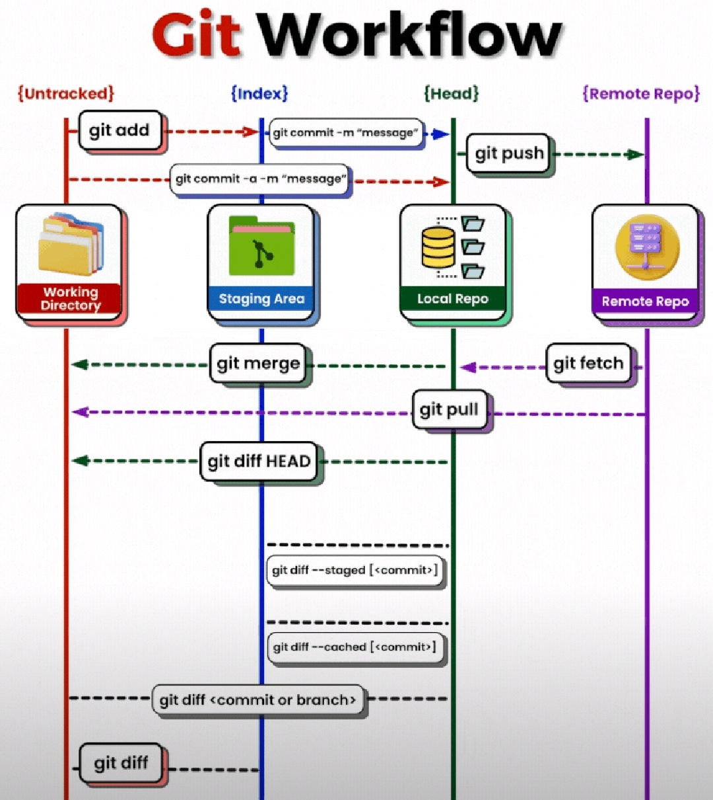

# VersionControlAdministrationDM

# Git

## Set-Up Git Version Control in PowerShell command line

The official Git-setup in PowerShell avaible is [here](https://git-scm.com/book/en/v2/Appendix-A%3A-Git-in-Other-Environments-Git-in-PowerShell)

Retrieve all available Git packages
~~~ps1
winget search --name git
<# EXAMPLE OUTPUT
Name                                                                 Id                               Version      Source
---------------------------------------------------------------------------------------------------------------------------
GitFiend                                                             9NMNKLTSZNKC                     Unknown      msstore
My Git                                                               9NLVK2SL2SSP                     Unknown      msstore
GitIssuesReportGenerator                                             9N6SDTJ8754N                     Unknown      msstore
GitVine                                                              9P3BLC2GW78W                     Unknown      msstore
GitCup                                                               9NBLGGH4XFHP                     Unknown      msstore
GitIt                                                                9NBLGGH40HV7                     Unknown      msstore
Dev Home GitHub Extension (Preview)                                  9NZCC27PR6N6                     Unknown      msstore
GitMind - Mind Map                                                   XPFMP3C8FNRG9P                   Unknown      msstore
Bhagavad Gita                                                        9WZDNCRFJCV5                     Unknown      msstore
GitLab CI/CD Tool                                                    9PK8QXP7H9DR                     Unknown      msstore
GitLooker                                                            9PK6TGX9T87P                     Unknown      msstore
GitLurker                                                            9N2MN78QLVKB                     Unknown      msstore
GitMind Mind Map                                                     XP8LG65GV4C7C8                   Unknown      msstore
Git                                                                  Git.Git                          2.43.0       winget
GitNote                                                              zhaopengme.gitnote               3.1.0        winget
Agent Git                                                            Xidicone.AgentGit                1.88         winget
WimyGit                                                              Wimysoft.WimyGit                 1.0.1        winget
git-absorb                                                           tummychow.git-absorb             0.6.10       winget
TortoiseGit                                                          TortoiseGit.TortoiseGit          2.15.0.0     winget
GitFiend                                                             TobySuggate.GitFiend             0.40.6       winget
Snagit 2024                                                          TechSmith.Snagit.2024            24.0.4.1148  winget
Snagit 2023                                                          TechSmith.Snagit.2023            23.2.2.636   winget
Snagit 2022                                                          TechSmith.Snagit.2022            22.1.1.21427 winget
Snagit 2021                                                          TechSmith.Snagit.2021            21.4.5.16756 winget
Snagit 2020                                                          TechSmith.Snagit.2020            20.1.8.16558 winget
gitui                                                                StephanDilly.gitui               0.24.3       winget
GitHubReleaseNotes                                                   StefHeyenrath.GitHubReleaseNotes 1.0.8.0      winget
Upgit                                                                pluveto.Upgit                    0.2.18       winget
GitBlade                                                             PirinelLtd.GitBlade              00.00.8.9    winget
Microsoft Git                                                        Microsoft.Git                    2.43.0.0.0   winget
Gitify                                                               manosim.gitify                   4.5.1        winget
Logitech Unifying Software                                           Logitech.UnifyingSoftware        2.52.33      winget
Logitech Sync                                                        Logitech.Sync                    3.2.204.0    winget
Logitech Solar App                                                   Logitech.Solar                   1.20.28      winget
Logitech SetPoint                                                    Logitech.SetPoint                6.90.66      winget
Logitech Presentation                                                Logitech.Presentation            1.60.33      winget
Logitech Options                                                     Logitech.Options                 10.10.58     winget
Logitech Gaming Software                                             Logitech.LGS                     9.04.28      winget
Logitech G HUB                                                       Logitech.GHUB                    2023.10.3254 winget
Logitech Camera Settings                                             Logitech.CameraSettings          2.12.8.0     winget
WSJT-X Digital Modes for Weak Signal Communications in Amateur Radio K1JT.wsjtx                       2.6.1        winget
lazygit                                                              JesseDuffield.lazygit            0.40.2       winget
gitg                                                                 gnome.gitg                       41.0         winget
GitLab Runner                                                        Gitlab.Runner                    16.7.0       winget
GitKraken CLI                                                        GitKraken.cli                    1.4.0        winget
Git LFS                                                              GitHub.GitLFS                    3.4.1        winget
GitHub Desktop Beta                                                  GitHub.GitHubDesktop.Beta        3.1.3-beta3  winget
GitHub Desktop                                                       GitHub.GitHubDesktop             3.3.5        winget
GitHub CLI                                                           GitHub.cli                       2.42.0       winget
Git Extensions                                                       GitExtensionsTeam.GitExtensions  4.2.1        winget
GitAhead                                                             GitAhead.GitAhead                2.6.3        winget
MinGit                                                               Git.MinGit                       2.41.0       winget
Fork - a fast and friendly git client                                Fork.Fork                        1.91.2       winget
FastGithub                                                           CoolPlayLin.FastGithub           2.1.4        winget
GitKraken                                                            Axosoft.GitKraken                9.11.1       winget
GitQL                                                                amrdeveloper.gitql               0.11.0       winget
GitTools GitVersion                                                  GitTools.GitVersion              5.12.0       winget
git-cola                                                             git-cola.git-cola                4.2.1        winget
Git for Windows SDK                                                  Git.SDK                          1.0.8        winget
Logitech Onboard Memory Manager (LogitechOMM)                        Logitech.OnboardMemoryManager    1.1.6805.0   winget
#>
~~~

Install Git
~~~ps1
write-host "Install winget tool if you don't already have it, then type this command in command prompt or Powershell."

<# 
Installs the selected package, either found by searching a configured source or directly from a manifest. By default, the query must case-insensitively match the id, name, or moniker of the package.
--id                                 Filter results by id.
-e,--exact                           Find package using exact match
-s,--source                          Find package using the specified source.
#>
winget install --id Git.Git -exact --source winget
~~~

~~~ps1
Install-Module posh-git -Scope CurrentUser -Force
Install-Module posh-git -Scope CurrentUser -Force

Import-Module posh-git
Add-PoshGitToProfile -AllHosts

write-host "`nSetting the default global email and the name of the git user..." 
git config --global user.email "GitUserEmail"
git config --global user.name "GitUserName"
~~~

If you see the error massage after pushing your work to GitHub, don't worry 
~~~ps1
+ git push
+ ~~~~~~~~
    + CategoryInfo          : NotSpecified: (To https://gith...l_scripting.git:String) [], RemoteException
    + FullyQualifiedErrorId : NativeCommandError
~~~
See a discussion about this essue [here](https://github.com/dahlbyk/posh-git/issues/109)

If Git find a directory unsafe because the current user is not the owner, run this command if you known who owns that directory
~~~ps1
git config --global --add safe.directory ${env:USERPROFILE}\PowerShellScriptingDM
~~~

To open the documentation page of a git command online, type the following command:
~~~sh
git CommandName --help
~~~

Push a local branch that is not yet referenced in .git/config file
~~~sh
git push --set-upstream remote BranchName
~~~
The command above will add the following entry in .git/config file
~~~
[branch "BranchName"]
	remote = origin
	merge = refs/heads/BranchName
~~~

Set the correct commiter after mistakenly commiting with the wrong one
~~~sh
# Edit the name and email of the global commiter on the local machine
git config --global --edit

# reset the name and email of the previous commit (not yet pushed) to the current correct global commiter
git commit --amend --reset-author

# The Vim editor command to enter the edit mode is i
# The Vim editor command to save your changes is esc then :wq
# Meaning: escape (esc) the interactive mode (i) the save the changes (w) and quit the vim editor (q).
~~~

Set the name and the email of the global commiter on a local computer
~~~sh
git config --global user.name "user-name"
git config --global user.name@domain
~~~

## Git Workflow

### (1) Core Commands

**git init** : 🚀 Initialize a new repository

**git clone** : 📥 Clone a repository

**git add** : ➕ Add changes to the staging area

**git commit** : ✍️ Commit changes to the repository

**git status** : 📊 Check status of your changes

**git diff** : 🔄 View the difference between changes

**git checkout** : 🔄 Switch branches or restore working tree files

**git reset** : ⏪ Reset changes in the working tree

**git log** : 📜 View commit history

**git show** : 🎫 Show information about a commit

**git tag** : 🏷️ Add tags to commits

**git push** : 🚀 Push changes to a remote repository

**git pull** : 🔄 Fetch changes from a remote repository

### (2) Branching

🌿 Manage branches: `git branch`

🏗️ Create and switch to a new branch: `git checkout -b`

🔄 Merge changes from one branch to another: `git merge`

🔄 Reapply changes on top of another branch: `git rebase`

🔄 Set up a tracking branch: `git branch --set-upstream-to`

🔄 Unset the upstream configuration: `git branch --unset-upstream`

🍒 Pick specific commits to apply: `git cherry-pick`

### (3) Merging

🔄 Merge changes from one branch to another: `git merge`

🔄 Reapply changes on top of another branch: `git rebase`

### (4) Stashing

📦 Temporarily save changes: `git stash`

📦 Apply stashed changes and remove them: `git stash pop`

📦 List all stashes: `git stash list`

📦 Apply stashed changes: `git stash apply`

📦 Discard a stash: `git stash drop`

### (5) Remotes

🔄 Manage remote repositories: `git remote`

➕ Add a remote repository: `git remote add`

➖ Remove a remote repository: `git remote remove`

🔄 Fetch changes from a remote repository: `git fetch`

🔄 Pull changes from a remote repository: `git pull`

🚀 Push changes to a remote repository: `git push`

🔄 Clone a repository with all branches: `git clone --mirror`

### (6) Configuration

⚙️ Configure Git settings: `git config`

⚙️ Configure global Git settings: `git config --global`

⚙️ Remove a Git configuration: `git reset config`

The entire Pro Git book, written by Scott Chacon and Ben Straub and published by Apress, is available [here](https://git-scm.com/book/en/v2).

L'intégralité du livre Pro Git, écrit par Scott Chacon et Ben Straub et publié par Apress, est disponible [ici](https://git-scm.com/book/fr/v2).

# GitHub

Install GitHub CLI (Optional)
~~~ps1
winget install --id GitHub.cli --exact --source winget
~~~

Install GitHub Desktop (Optional)
~~~ps1
winget install --id GitHub.GitHubDesktop --exact --source winget
~~~

# TortoiseGit

Install TortoiseGit (Optional)
~~~ps1
winget install --id TortoiseGit.TortoiseGit --exact --source winget
~~~
